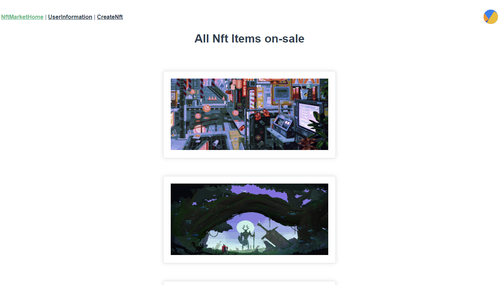

# NFT Marketplace
## Overview
This is a Nft Marketplace Dapp, users can upload their pictures and create Nft items, and can also buy and sell Nft items. 
## Usage
This project is based on Vue and truffle, so basicly you should install these 2 framework.
### import dependencies
```angular2html
npm install
```
### start backend (deploy smart contract)
Our contract is in the 'contracts' folder, if we would like to use it, we should deploy this contract into a blockchain network.
#### start/connect a blockchain network
We can use ganache to build a local blockchain network. Please the official website of ganache to see how to install and start ganache: https://trufflesuite.com/ganache/
#### install a crypto wallet
We can use Metamask, try to install the plugin of metamask in chrome: https://chrome.google.com/webstore/detail/metamask/nkbihfbeogaeaoehlefnkodbefgpgknn?hl=en-US
#### use metamask to connect crypto wallet
please see the official website of metamask: https://metamask.io/
#### deploy/migrate smart contract
```angular2html
truffle migrate
```
#### test smart contract
```
truffle test
```
### start frontend
```angular2html
npm run serve
```


